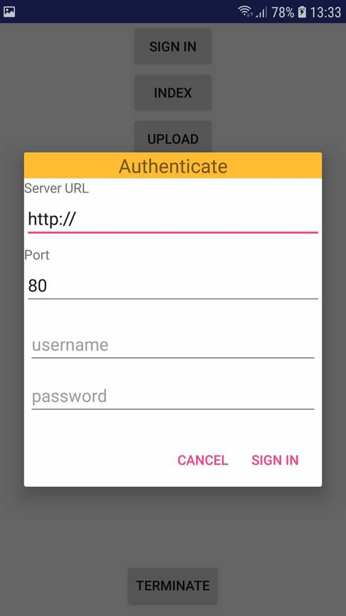
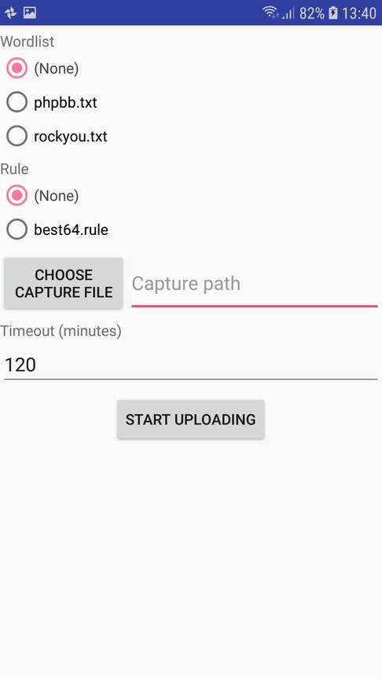

# Hashcat WPA Android Client

Android client for [hashcat-wpa-server](https://github.com/dizcza/hashcat-wpa-server).

This project is archived since it's easier to support only the web browser version.

Here are the screenshots:

